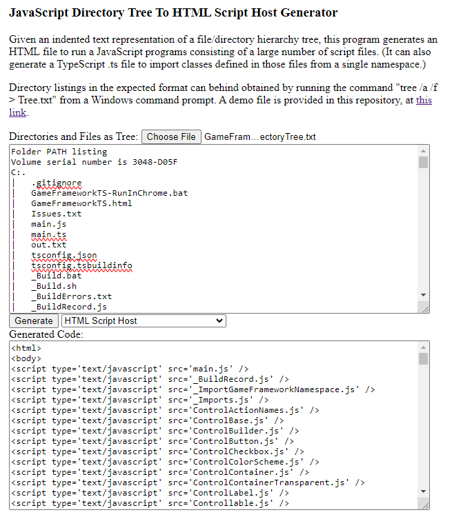

JsDirectoryTreeToHtmlScriptHostGenerator
========================================

Given a structure of directories containing JavaScript files, this program will build an HTML file that includes all those JavaScript files as script elements.

To obtain a text representation of a tree of directories and their file contents, the command "tree /a /f" can be run from a Windows command prompt.

